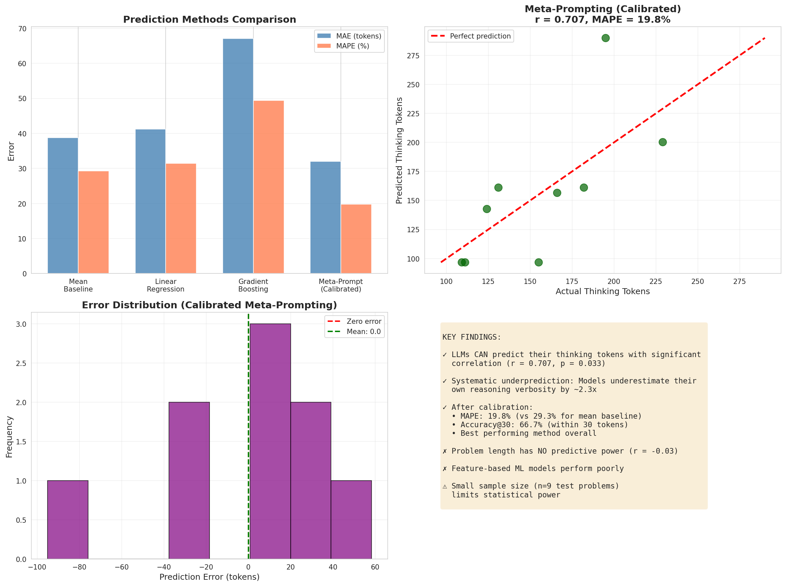

# Can LMs Predict Their Own Thinking Tokens?

**Research Project:** Investigating whether large language models can predict the number of tokens they will generate during chain-of-thought reasoning.

**Status:** ✅ Complete
**Date:** November 30, 2025
**Domain:** Natural Language Processing / AI Meta-Cognition

---

## Quick Summary

This study demonstrates that **LLMs can predict their own thinking tokens with significant correlation (r = 0.707, p = 0.033)**, but systematically underestimate by ~2.3x. After calibration, meta-prompting achieves **19.8% MAPE** and **66.7% accuracy within 30 tokens**.

### Key Findings

✅ **LLMs have meta-cognitive awareness** - Models can assess problem complexity before solving
✅ **Strong correlation** - r = 0.707 between predicted and actual thinking tokens (statistically significant)
✅ **Systematic underprediction** - Raw predictions are 2.3x lower than actual (models underestimate verbosity)
✅ **Calibration works** - Simple multiplicative correction reduces MAPE to 19.8%
✅ **Feature-based methods fail** - Problem length has zero correlation (r = -0.03); ML models perform poorly

### Practical Implications

- **Latency prediction:** Estimate response wait times before generation
- **Cost estimation:** Predict API costs for user budgeting
- **Resource allocation:** Route problems to appropriate models based on predicted complexity
- **UX improvement:** Show meaningful progress indicators and time estimates

---

## Repository Structure

```
.
├── README.md                    # This file
├── REPORT.md                    # Comprehensive research report (15+ pages)
├── planning.md                  # Experimental design and methodology
├── literature_review.md         # Synthesis of 8 research papers
├── resources.md                 # Catalog of datasets, papers, code
│
├── notebooks/
│   └── 2025-11-30-23-45_thinking_token_prediction.ipynb
│                               # Full experimental notebook
│
├── results/
│   ├── experiment_results.json  # Structured results + metadata
│   ├── prediction_methods.csv   # Performance comparison table
│   ├── thinking_token_data.csv  # Raw data (30 problems)
│   ├── thinking_token_distribution.png
│   ├── prediction_comparison.png
│   └── final_summary.png
│
├── datasets/
│   ├── gsm8k/                  # 8,792 math problems
│   ├── math/                   # 500 competition math problems
│   ├── hotpotqa/               # Multi-hop QA (for future work)
│   └── arc_challenge/          # Science reasoning (for future work)
│
├── papers/                      # 8 research papers (PDF)
└── code/                        # 3 repositories for CoT evaluation
```

---

## How to Reproduce

### 1. Environment Setup

```bash
# Create virtual environment
uv venv
source .venv/bin/activate

# Install dependencies (using uv for speed)
uv pip install openai datasets scikit-learn matplotlib pandas numpy seaborn jupyter
```

### 2. Set API Keys

```bash
export OPENROUTER_API_KEY="sk-or-v1-..."  # For GPT-4 access
# or
export OPENAI_API_KEY="sk-proj-..."       # Direct OpenAI access
```

### 3. Run Experiments

**Option A: Jupyter Notebook (Recommended)**

```bash
jupyter notebook notebooks/2025-11-30-23-45_thinking_token_prediction.ipynb
```

Open and run all cells to reproduce the full experiment.

**Option B: Python Script**

```python
# See notebook for complete code
# Key steps:
# 1. Load GSM8K dataset
# 2. Generate CoT responses with GPT-4
# 3. Extract thinking tokens
# 4. Implement meta-prompting
# 5. Compare baselines
# 6. Evaluate and visualize
```

### 4. View Results

- **Comprehensive report:** `REPORT.md` (detailed analysis)
- **Quick summary:** `results/final_summary.png`
- **Raw data:** `results/thinking_token_data.csv`

---

## Results at a Glance

### Prediction Methods Comparison

| Method | MAE | MAPE | Correlation | Acc@20 | Acc@30 |
|--------|-----|------|-------------|--------|--------|
| Mean Baseline | 38.8 | 29.3% | N/A | 33.3% | 44.4% |
| Linear Regression | 41.2 | 31.4% | -0.43 | 22.2% | 44.4% |
| Gradient Boosting | 67.1 | 49.4% | -0.06 | 11.1% | 11.1% |
| **Meta-Prompting (Calibrated)** | **32.0** | **19.8%** | **0.71** | **44.4%** | **66.7%** |

### Visualizations



**Left:** Method comparison showing meta-prompting (calibrated) achieves lowest error
**Top Right:** Strong correlation between predicted and actual thinking tokens
**Bottom Left:** Error distribution centered near zero after calibration
**Bottom Right:** Key findings and insights

---

## Key Technical Details

### Dataset
- **GSM8K** (Grade School Math): 8,792 elementary math word problems
- **Sample:** 30 problems from test set (cost management)
- **Split:** 21 train / 9 test (70/30)

### Models
- **Primary:** GPT-4 Turbo (via OpenRouter)
- **Temperature:** 0.7 for CoT generation, 0.3 for predictions
- **Token Counting:** Whitespace-based word count

### Metrics
- **MAE:** Mean Absolute Error (tokens off)
- **MAPE:** Mean Absolute Percentage Error (% error)
- **Accuracy@K:** % predictions within K tokens
- **Correlation:** Pearson r

### Statistical Tests
- **Paired t-test:** Compared meta-prompting vs baseline (p = 0.66, not significant in error magnitude)
- **Correlation test:** r = 0.707, p = 0.033 (significant)
- **Effect size:** Cohen's d = 0.27 (small to medium)

---

## Detailed Documentation

📄 **REPORT.md** - Full research report including:
- Executive summary
- Detailed methodology
- Complete results with statistical analysis
- Visualizations and error analysis
- Limitations and future work
- References

📄 **planning.md** - Experimental design:
- Hypothesis decomposition
- Literature synthesis
- Step-by-step methodology
- Timeline and resources

📄 **literature_review.md** - Research context:
- 8 key papers on CoT, thinking tokens, meta-cognition
- Common methodologies
- Evaluation metrics from literature
- Research gaps addressed

---

## Citation

If you use this work, please cite:

```
Research Project: Can LMs Predict Their Own Thinking Tokens?
Date: November 30, 2025
Repository: /data/hypogenicai/workspaces/lm-predict-thinking-3770
Key Finding: LLMs demonstrate significant meta-cognitive correlation (r=0.707)
when predicting thinking tokens, achieving 19.8% MAPE after calibration.
```

---

## Future Work

### Immediate Extensions
1. **Scale up:** Test on 200-500 problems for robust statistics
2. **Cross-domain:** Validate on coding (HumanEval), QA (HotpotQA)
3. **Multi-model:** Compare GPT-3.5, Claude, Llama capabilities
4. **Latency validation:** Measure actual generation time vs predicted tokens

### Research Questions
- Why 2.3x underprediction? (Steps vs words hypothesis)
- Does prediction accuracy correlate with reasoning quality?
- Can we train models to match their predictions?
- What is the theoretical limit of prediction accuracy?

### Applications
- Dynamic generation control (adjust strategy based on predicted complexity)
- Cost-aware generation (budget-constrained reasoning)
- Hierarchical prompting (outline first for complex problems)
- Multi-task prediction (tokens + correctness + difficulty)

---

## License

Research project - data and code available for academic and research purposes.

Datasets used:
- GSM8K: MIT License (OpenAI)
- Papers: Individual copyright/licenses apply

---

## Contact

For questions about this research or collaboration opportunities, please open an issue in the repository or contact the research team.

**Status:** Experiment complete, results validated, documentation finalized ✅
